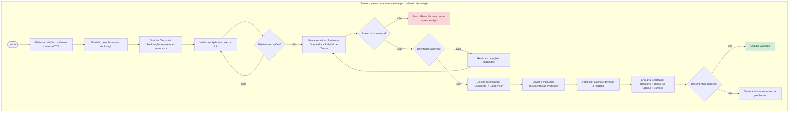
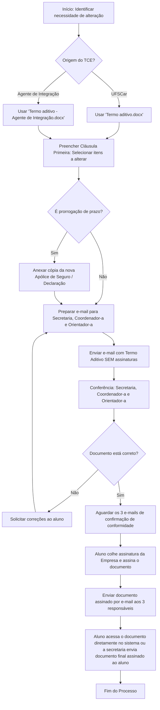
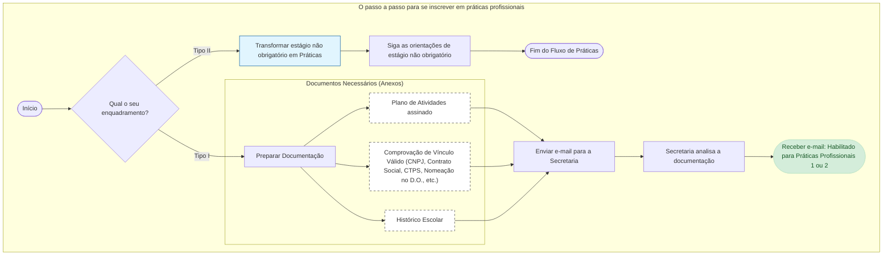
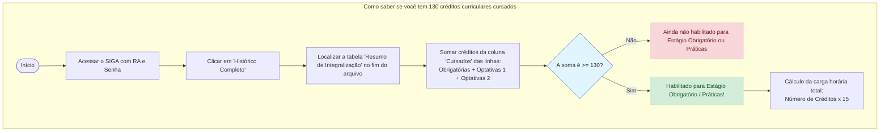

# Estágios e Práticas Profissionais

Este é o documento principal sobre estágios e práticas profissionais, que são disciplinas de conclusão de curso. Se preferir, você pode [interagir com este conteúdo usando um Notebook](https://notebooklm.google.com/notebook/03c8e01e-63f0-4fcd-9a5d-d133e3a93adf) do [Notebooklm](https://notebooklm.google.com/). Pode fazer perguntas e tirar as suas dúvidas. Mas **sempre** vá até o ponto de referência citado na resposta e a confira. 

As Disciplinas de Conclusão de Curso são: 
- Estágio Supervisionado 1 e Estágio Supervisionado 2;
- Práticas Profissionais em Computação 1 e Práticas Profissionais em Computação 2;
- Iniciação à Pesquisa  ou Projeto de Pesquisa;
- Seminários de Computação.

Vamos agrupar estas disciplinas em:
- Grupo A: Estágio Supervisionado 1, Práticas Profissionais em Computação 1, Iniciação à Pesquisa;
- Grupo B: Estágio Supervisionado 2, Práticas Profissionais em Computação 2, Projeto de Pesquisa.

O aluno pode: 
- fazer qualquer disciplina do Grupo A seguido de uma disciplina do grupo B;
- fazer uma disciplina do Grupo A e uma do Grupo B no mesmo semestre.

Ao se inscrever em uma disciplina do Grupo B, o aluno deve também se inscrever em Seminários de Computação, que é correquisito de qualquer disciplina deste grupo. 

Este documento detalha Estágio Supervisionado 1 e 2  e  Práticas Profissionais em Computação 1 e 2. 

Embora seja legal, pelo Projeto Pedagógico, fazer ES 1 ou 2  e também  PP 1 ou 2 no mesmo semestre, na prática isto é quase impossível, pois em ES você estaria estagiando e em PP você estaria já trabalhando. Teria que ser em dois lugares diferentes. 

## Informações Gerais

>[!green]
>**Coordenador de Disciplinas de Conclusão de Curso**: Prof. José de Oliveira Guimarães  
>**Secretária**: Marlene Castilho, bccs@ufscar.br 
>
>>[!red]  
>>Todos os e-mails relativos a estágio devem ser enviados unicamente a bccs@ufscar.br.  Não envie e-mails diretamente para o Coordenador de Disciplinas de Conclusão de Curso.
> 
> Em caso de férias da secretaria ou do coordenador, haverá um aviso neste documento, nesta mesma seção, com os endereços de e-mail que devem ser usados para estágio.
%% <span style="color:red">Your text here</span> %%

>[!red]
> **Toda a documentação de estágio precisa ser enviada para a Secretaria do Curso via e-mail corporativo (da empresa) na qual o aluno está estagiando (podendo ser  do aluno, do supervisor ou do RH). Isto foi decidido na 56ª Reunião Extraordinária do CCCC-So (Conselho do Curso de Ciência da Computação de Sorocaba), em 25/06/2021**. 

### Documentos Importantes

Sempre que houver alguma dúvida, consulte os documentos abaixo além deste texto que você está lendo.

- Lei de Estágio, [**LEI Nº 11.788, DE  25 DE SETEMBRO DE 2008**](http://legislacao.planalto.gov.br/legisla/legislacao.nsf/Viw_Identificacao/lei%2011.788-2008?OpenDocument). 
- [Cartilha Esclarecedora](http://www.dcomp.ufscar.br/wp-content/uploads/2012/07/Cartilha_Lei_Estagio.pdf) sobre o estágio.
- [Termos de compromisso de estágio (TCE) -- documentos da UFSCar](https://www.prograd.ufscar.br/estudantes-de-graduacao/estagios-1/termos-de-compromisso-de-estagio). Aqui estão os modelos de TCE da UFSCar. Você os usará a menos que o estágio seja feito por uma agência integradora de estágio. O TCE é o documento que liga você, a empresa e a UFSCar em um estágio. [[#Modelos de Documentos|Outros documentos específicos do BCC e CDIA estão aqui.]]
- [Página da UFSCar sobre estágios](https://www.prograd.ufscar.br/pt-br/estudantes/estagios)

### Modelos de Documentos 

Nas disciplinas de Estágio Supervisionado 1 e 2 e Práticas Profissionais 1 e 2, será necessário utilizar vários documentos que estão em duas pastas do Google Drive:
- [Estagio Supervisionado](https://drive.google.com/drive/folders/1jQ3aCo5fS-BEhLwvwfodRF21V5EOAXpU?usp=sharing);
- [Práticas Profissionais](https://drive.google.com/drive/folders/1nCgDMSxRMI4rDVgJKILbKZK1pPpYw3L8?usp=sharing).

Estes documentos são modelos que você deve baixar e modificar. Para ter acesso a esta pasta , **você deve estar com o _log in_ da sua conta na UFSCar**. 
### Instruções para envio de e-mail

Este documento tenta padronizar os assuntos e corpos dos e-mails por meio de _links_ para a plataforma de e-mails padrão. Então, há inúmeros _links_ do tipo

[Envie este e-mail para testar esta funcionalidade](mailto:anything@mailinator.com?subject=Teste%2C%20ignore&body=No%20exemplo%20real%2C%20o%20destinat%C3%A1rio%20ser%C3%A1%20%0A%20%20%20%20%20bccs%40ufscar.br%0A%0AVoc%C3%AA%20precisar%C3%A1%20mudar%20o%20emitente%20da%20mensagem%20para%20o%20email%20da%20empresa%20ou%2C%20se%20voc%C3%AA%20ainda%20n%C3%A3o%20tem%20este%20email%2C%20para%20o%20seu%20email%20da%20UFSCar.%20%0A%0AN%C3%A3o%20precisa%20clicar%20no%20bot%C3%A3o%20de%20enviar%2C%20isto%20%C3%A9%20apenas%20um%20teste.%0A%0A)

Ao clicar em um destes _links_, será aberta a página da plataforma de e-mail ou o aplicativo de e-mail padrão do seu Sistema Operacional.  Se, ao clicar, aparecer uma página em branco no navegador, o aplicativo padrão de e-mails do seu SO não foi definido. Você precisa definir um. O Android e iOS já têm um aplicativo padrão pré-definido. 

**Sempre envie os e-mails para bccs@ufscar.br usando estes _links_**, que começam sempre com "Envie este e-mail ...". A menos que você queira alguma informação que não esteja descrita neste documento. **Não envie e-mails diretamente para o coordenador de estágios, a menos que este documento o diga para fazê-lo**. 

O assunto ou o corpo do e-mail geralmente têm partes como seu-nome e professor-orientador que devem substituídos pelos nomes reais. Os trechos entre /* e \*/  são apenas comentários sobre o que você deve fazer, como anexar tais e tais documentos. 

Não modifique nada a não ser os seus dados pessoais (nome, RA, etc.)  pois possivelmente esta etapa será posteriormente automatizada. Após clicar, será aberta a página da plataforma  padrão de e-mails ou um aplicativo padrão. Após isto, clique em "Coord. BCC Sorocaba (bccs@ufscar.br)" e mude o remetente, que deve ser o endereço de e-mail corporativo (da empresa) na qual o aluno está estagiando (podendo ser do e-mail do aluno, do supervisor ou do RH). Se você ainda não tem e-mail da empresa, use o seu e-mail da UFSCar.

## O que você quer fazer？ 

- [[#Estágio Supervisionado|Um estágio obrigatório ou não obrigatório]]
	* Para o estágio obrigatório, você deve ter mais do que 130 créditos curriculares cursados (ou 1950 horas). [[#Como saber se você tem 130 créditos curriculares cursados (ou 1950 horas)|Veja aqui como saber se você satisfaz esta condição]]. Você deve se inscrever na disciplina Estágio Supervisionado 1 ou Estágio Supervisionado 2 (se já cursou o ES 1) ou em ambas. Cada disciplina exige 180h. Se você for trabalhar 360h, pode se inscrever nas duas disciplinas no mesmo semestre.
	  Algumas empresas como ITAÚ e BAYER não oferecem estágio obrigatório. Você pode fazer estágio não obrigatório e depois validar como [[#Práticas Profissionais em Computação 1 e Práticas Profissionais em Computação 2|Práticas Profissionais]]. 
	* Para o estágio **não** obrigatório, você **não** se inscreve em nenhuma disciplina. Você pode validar um estágio não obrigatório como Atividade Complementar. Você não pode ter reprovação por frequência em nenhuma disciplina no semestre letivo anterior. 
	* É possível começar o estágio em até seis (6) meses antes do início do período letivo da sua inscrição na disciplina de estágio. 
- [[#Práticas Profissionais em Computação 1 e Práticas Profissionais em Computação 2|Práticas profissionais]]. Escolha este item se você já trabalha em alguma empresa ou por conta própria. Esta atuação profissional  permite que você se  inscreva nas disciplinas **Práticas Profissionais em Computação 1** e **Práticas Profissionais em Computação 2**. Você fará estas disciplinas em vez de Estágio Supervisionado 1 e 2. 
- **Iniciação à Pesquisa**  ou **Projeto de Pesquisa**. Você pode validar uma Iniciação Científica (IC) como **Iniciação à Pesquisa**.  A IC pode ser feita em qualquer ponto do curso. Já **Projeto de Pesquisa** só pode ser feito após você ter cursado 130 créditos ou 1950 horas de disciplinas. Veja o Projeto Pedagógico do seu curso para  informações adicionais.
- [Validar um estágio não obrigatório como Atividade Complementar.](https://www.dcomp.ufscar.br/alunos/)
- [Validar um estágio obrigatório como Atividade Complementar.](https://www.dcomp.ufscar.br/alunos/) Isto é possível após você ter feito as duas disciplinas de conclusão de curso (exemplo: Estágio Supervisionado 1 e 2). 
- [[#Mudar a modalidade de estágio não obrigatório para obrigatório]].
- [[#Passo a passo para fazer um Termo Aditivo ao TCE|Já faço estágio, mas quero alterar um dos seguintes itens do TCE: carga horária, plano, orientador, supervisor, período, modalidade (não obrigatório para obrigatório).]] 
- [[#Rescisão|Rescindir o estágio]].
- Já trabalho profissionalmente. Quero [[#Validar Atividade Profissional como Estágio Supervisionado]]. 
  

## Estágio Supervisionado

Nas disciplinas de Estágio Supervisionado 1 e 2, não há encontros em sala de aula. Contudo, o estágio será acompanhado por um **professor orientador** de estágio da **UFSCar** que será atribuído pela secretaria do curso a cada estagiário.  Na **empresa**, você terá um **supervisor de estágio**.

O professor orientador acompanha o estágio via e-mail, reuniões, etc. Ao final do estágio, você deve fazer um relatório  e enviar ao  orientador.

As 360 horas de estágio obrigatório cabem em um período letivo. Então, você pode se inscrever em uma (12 créditos ou 180h) ou nas duas disciplinas (Estágio Supervisionado 1 e 2, 24 créditos ou 360h) em um mesmo semestre.

Você pode começar o estágio em uma data e começar a cursar a disciplina de Estágio Supervisionado 1 ou 2 até 6 meses depois da data do início do estágio. Por exemplo, você pode começar o estágio em 20 de outubro, fazer a inscrição na disciplina ES 1 ou ES 2 em janeiro ou fevereiro e começar a "cursar" a disciplina em 10 de março do próximo ano. Mas não em 21 de março.

Em um caso raro, é possível que você faça um estágio contínuo de um ano mas se inscreva em ES 1 em um semestre, não se inscreva em ES 2 no próximo semestre e se inscreva em ES 2 um ano após a inscrição em ES 1. Neste caso (raro), use o primeiro semestre do estágio (ou as primeiras 180h) para validar ES1, e o segundo semestre (ou as próximas 180h) para validar ES 2.

Existe a possibilidade de você continuar o estágio após a conclusão das disciplinas  Estágio Supervisionado 1 e 2. Isto é, mesmo após ter feito 360h de estágio, você continua no estágio. Os relatórios subsequentes, após as 360h obrigatórias, podem ser usado para a validação de Atividades Complementares. 

Se você se inscreveu na(s) disciplina(s) de estágio e não está estagiando ou reprovou, você pode fazer o processo novamente. 

A UFSCar oferece estágio sem remuneração. Qualquer professor ou TA pode oferecer estágio, atuando como o supervisor de estágio. O "representante da empresa" deve ser o chefe do Departamento em que o professor ou TA está alocado. Neste caso, siga as [[#Instruções sobre seguro pago pela UFSCar]].

### O passo a passo do processo para se tornar um estagiário

1. Encontre uma empresa de sua preferência, participe do processo de seleção. Se selecionado, passe para o próximo passo. 
2. Se este é o seu primeiro estágio, vá para o passo 3 abaixo. Se você já faz estágio, você só pode começar um novo estágio após finalizar o anterior.  
   
   Se seu TCE foi rescindido, [envie este email para a secretaria do curso e para o(a) coordenador(a) de estágios](mailto:bccs@ufscar.br,estagio.bcc.so.ufscar@gmail.com?subject=Termo%20de%20rescis%C3%A3o%20de%20est%C3%A1gio%20da%20UFSCar&body=%C3%80%20secretaria%20do%20curso%20de%20Ci%C3%AAncia%20da%20Computa%C3%A7%C3%A3o%20de%20Sorocaba%20e%20ao(%C3%A0)%20coordenador(a)%20de%20est%C3%A1gios%3A%0A%0Aestou%20enviando%20em%20anexo%20a%20declara%C3%A7%C3%A3o%20de%20rescis%C3%A3o%20de%20est%C3%A1gio%20do%20modelo%20UFSCar%20obtido%20da%20p%C3%A1gina%20%0A%20%20%20%20%20https%3A%2F%2Fwww.prograd.ufscar.br%2Fpt-br%2Festudantes%2Festagios%2Ftermos-de-compromisso-de-estagio%0A%0AAt.te%2C%0A%0Aseu-nome%20-%20RA%0A%0A). Anexe o "Termo de rescisão de estágio.docx" ou "Termo de rescisão de estágio - Agente de integração.docx"  [desta página da UFSCar](https://www.prograd.ufscar.br/pt-br/estudantes/estagios/termos-de-compromisso-de-estagio).
   
   
   Se a empresa não entregou um termo de rescisão, [envie este email para a secretaria do curso e  para o(a) coordenador(a) de estágios ](mailto:bccs@ufscar.br,estagio.bcc.so.ufscar@gmail.com?subject=Termo%20de%20rescis%C3%A3o%20de%20est%C3%A1gio%20do%20BCC-So&body=%C3%80%20secretaria%20do%20curso%20de%20Ci%C3%AAncia%20da%20Computa%C3%A7%C3%A3o%20de%20Sorocaba%20e%20ao(%C3%A0)%20coordenador(a)%20de%20est%C3%A1gios%3A%0A%0Aestou%20enviando%20em%20anexo%3A%0A%20%20-%20a%20declara%C3%A7%C3%A3o%20de%20rescis%C3%A3o%20de%20est%C3%A1gio%3B%0A%20%20-%20um%20comprovante%20da%20rescis%C3%A3o.%0A%0AUtilizei%20o%20modelo%20de%20documento%20recomendado%20que%20est%C3%A1%20no%20Google%20Drive%2C%20que%20%C3%A9%20%22Estagi%C3%A1rios%20-%20Declara%C3%A7%C3%A3o%20de%20Rescis%C3%A3o.docx%22.%20%0A%0AAt.te%2C%0A%0Aseu-nome%20-%20RA%0A%0A). Anexe  a declaração [Estagiários - Declaração de Rescisão.docx](https://docs.google.com/document/d/1_XPdmxqL7XUEooF4jJoRSBG51AwYupE1/edit?usp=drive_link&ouid=109494445287776862928&rtpof=true&sd=true) junto com alguma comprovação da sua rescisão. 
   
   Se você tem um TCE encerrado e não entregou o(s) relatório(s) correspondente(s), entregue-o(s) na Secretaria do curso.   Se você já fez estágio anteriormente, lembre-se de que **não será assinado um novo TCE até você entregar a documentação pendente**.

3. Este passo se divide em várias partes, dependendo se você já fez estágio antes e se o estágio que você _**quer fazer**_ é obrigatório ou não e se é ES 1 ou ES 2. 
   
     - você nunca fez estágio, apenas clique em  um dos _links_. 
         * estágio obrigatório.    [Envie este e-mail para a secretaria do curso](mailto:bccs@ufscar.br?subject=novo%20est%C3%A1gio%20obrigat%C3%B3rio&body=%C3%80%20secretaria%20do%20curso%20de%20Ci%C3%AAncia%20da%20Computa%C3%A7%C3%A3o%20de%20Sorocaba%3A%0A%0Agostaria%20de%20come%C3%A7ar%20um%20est%C3%A1gio%20obrigat%C3%B3rio.%20%0A%0AEu%20nunca%20fiz%20est%C3%A1gio%20pela%20UFSCar%2C%20nem%20mesmo%20est%C3%A1gio%20n%C3%A3o%20obrigat%C3%B3rio.%20%0A%0AAsseguro%20que%20tenho%20130%20cr%C3%A9ditos%20curriculares%20cursados%20(ou%201950%20horas)%2C%20conferidos%20a%20partir%20do%20hist%C3%B3rico%20escolar%20em%20anexo.%0A%0Aseu-nome%20-%20RA%0A%0A%2F*%20anexe%20o%20Hist%C3%B3rico%20Escolar%20*%2F). Anexe o Histórico Escolar; 
         * estágio não obrigatório.   [Envie este e-mail para a secretaria do curso](mailto:bccs@ufscar.br?subject=novo%20est%C3%A1gio%20n%C3%A3o%20obrigat%C3%B3rio&body=%C3%80%20secretaria%20do%20curso%20de%20Ci%C3%AAncia%20da%20Computa%C3%A7%C3%A3o%20de%20Sorocaba%3A%0A%0Agostaria%20de%20come%C3%A7ar%20um%20est%C3%A1gio%20N%C3%83O%20obrigat%C3%B3rio.%20%0A%0ANunca%20fiz%20est%C3%A1gio%20na%20UFSCar%20pelo%20curso%20de%20Ci%C3%AAncia%20da%20Computa%C3%A7%C3%A3o%20de%20Sorocaba.%20%0A%0AEu%20afirmo%20que%20n%C3%A3o%20fui%20reprovado%20por%20frequ%C3%AAncia%20em%20nenhuma%20disciplina%20no%20semestre%20anterior.%20%0A%0AAt.te%2C%0A%0Aseu%20nome%20-%20RA%0A%0A) 
	- você já fez estágio anteriormente:
	    * estágio obrigatório, disciplina ES 1.    [Envie este e-mail para a secretaria do curso](mailto:bccs@ufscar.br?subject=novo%20est%C3%A1gio%20obrigat%C3%B3rio&body=%C3%80%20secretaria%20do%20curso%20de%20Ci%C3%AAncia%20da%20Computa%C3%A7%C3%A3o%20de%20Sorocaba%3A%0A%0Agostaria%20de%20come%C3%A7ar%20um%20est%C3%A1gio%20obrigat%C3%B3rio.%20%0A%0AJ%C3%A1%20fiz%20est%C3%A1gio%20anteriormente%20e%20entreguei%20toda%20a%20documenta%C3%A7%C3%A3o%20relativa%20ao%20%C3%BAltimo%20est%C3%A1gio.%0A%0AAsseguro%20que%20tenho%20130%20cr%C3%A9ditos%20curriculares%20cursados%20(ou%201950%20horas)%2C%20conferidos%20a%20partir%20do%20hist%C3%B3rico%20escolar%20em%20anexo%0A%0Aseu-nome%20-%20RA%0A%0A%2F*%20anexe%20o%20Hist%C3%B3rico%20Escolar%20*%2F). Anexe o Histórico Escolar;
	    * estágio obrigatório, disciplina ES 2.    [Envie este e-mail para a secretaria do curso](mailto:bccs@ufscar.br?subject=novo%20est%C3%A1gio%20obrigat%C3%B3rio&body=%C3%80%20secretaria%20do%20curso%20de%20Ci%C3%AAncia%20da%20Computa%C3%A7%C3%A3o%20de%20Sorocaba%3A%0A%0Agostaria%20de%20come%C3%A7ar%20um%20est%C3%A1gio%20obrigat%C3%B3rio%20correspondente%20%C3%A0%20disciplina%20Est%C3%A1gio%20Supervisionado%202.%20%0A%0AJ%C3%A1%20fiz%20est%C3%A1gio%20anteriormente%20e%20entreguei%20toda%20a%20documenta%C3%A7%C3%A3o%20relativa%20ao%20%C3%BAltimo%20est%C3%A1gio.%0A%0Aseu-nome%20-%20RA%0A)
         * estágio não obrigatório.   [Envie este e-mail para a secretaria do curso](mailto:bccs@ufscar.br?subject=novo%20est%C3%A1gio%20n%C3%A3o%20obrigat%C3%B3rio&body=%C3%80%20secretaria%20do%20curso%20de%20Ci%C3%AAncia%20da%20Computa%C3%A7%C3%A3o%20de%20Sorocaba%3A%0A%0Agostaria%20de%20come%C3%A7ar%20um%20est%C3%A1gio%20N%C3%83O%20obrigat%C3%B3rio.%20%0A%0AJ%C3%A1%20entreguei%20toda%20a%20documenta%C3%A7%C3%A3o%20relativa%20ao%20%C3%BAltimo%20est%C3%A1gio.%0A%0AEu%20afirmo%20que%20n%C3%A3o%20fui%20reprovado%20por%20frequ%C3%AAncia%20em%20nenhuma%20disciplina%20no%20semestre%20anterior.%20%0A%0AAt.te%2C%0A%0Aseu%20nome%20-%20RA%0A%0A) 

A secretaria do curso irá te atribuir um orientador de estágio. O representante da UFSCar na assinatura do TCE será sempre o Coordenador de Estágio a menos de força maior como férias ou afastamentos. Normalmente, o docente orientador supervisiona todos os estágios do(a) estudante durante o curso.

O TCE é um Termo de Compromisso de Estágio. A empresa pode utilizar um modelo da UFSCar, disponível **[aqui](http://www.prograd.ufscar.br/estudantes-de-graduacao/estagios-1/termos-de-compromisso-de-estagio)**  ou a empresa pode usar uma agência integradora como intermediária (NUBE, CIEE, etc.), que possui o seu próprio modelo de TCE. 
4. Preencha o TCE mas **não colete** nenhuma assinatura ainda. 
5. Use a [[#Lista de conferências do TCE|Lista de conferências do TCE]]  para verificar se o TCE está de acordo com as normas da UFSCar.  Lembre-se de que você **NÃO PODE** modificar as cláusulas do TCE da UFSCar ou de uma agência integradora. Qualquer modificação nas cláusulas será considerada um desvio ético. 
6. [Vá no aplicativo _web_ de estágios](https://estagios-bcc-so-ufscar-conferencias.netlify.app/), digite os dados, gere a pergunta para um aplicativo de IA na opção "Um TCE" e faça as correções apontadas. Repita este passo até que não existam correções a fazer. A menos que você tenha certeza de que o aplicativo esteja errado, naturalmente. 
7. [Envie este e-mail para a secretaria do curso e para o coordenador de estágio](mailto:bccs@ufscar.br,estagio.bcc.so.ufscar@gmail.com?subject=TCE%20a%20ser%20revisado&body=%C3%80%20secretaria%20do%20curso%20de%20Ci%C3%AAncia%20da%20Computa%C3%A7%C3%A3o%20de%20Sorocaba%20e%20ao(%C3%A0)%20coordenador(a)%20de%20est%C3%A1gios%3A%0A%0Aestou%20enviando%20em%20anexo%20um%20TCE%20para%20ser%20revisado.%20%0A%0AAsseguro%20que%20as%20cl%C3%A1usulas%20do%20modelo%20de%20TCE%20da%20UFSCar%20ou%20da%20ag%C3%AAncia%20integradora%20n%C3%A3o%20foram%20alteradas.%0A%0AAo%20fim%20deste%20email%20est%C3%A1%20o%20relat%C3%B3rio%20emitido%20por%20um%20aplicativo%20de%20IA%20sobre%20o%20TCE.%20%0A%0AA%20pergunta%20feita%20ao%20aplicativo%20foi%20aquela%20emitida%20pelo%20aplicativo%20web%20%27Est%C3%A1gio%20BCC-So%20da%20UFSCar%27%20dispon%C3%ADvel%20em%20https%3A%2F%2Festagio-bcc-so-ufscar-conferencias.netlify.app.%20%0A%0AFoi%20acoplado%20ao%20aplicativo%20de%20IA%20o%20arquivo%20do%20meu%20TCE.%0A%0AAt.te%2C%0A%0Aseu-nome%20-%20RA%0A%0A%2F*%20coloque%20aqui%20o%20relat%C3%B3rio%20emitido%20pelo%20aplicativo%20de%20IA%20*%2F) anexando o TCE preenchido. Ao fim deste e-mail, você deve inserir a resposta do aplicativo de IA do passo anterior. É para inserir no final, não para anexar. 
      
   Comunique à empresa que o curso reserva até 4 dias úteis para conferir que o TCE está de acordo com as normas do curso, da UFSCar e da Lei.   
8. **Após você receber um e-mail** de bccs@ufscar.br e **também** receber um e-mail do coordenador(a) de estágios certificando que o TCE está correto, faça duas coisas:  
	- **colete as assinaturas** da empresa por meio de assinatura digital. Veja mais informações sobre [[#Assinatura digital|Assinatura digital]].   
	- [[#Assinaturas em papel|Siga estas recomendações para assinatura em papel.]]
	- Peça à empresa ou agência integradora a **cópia completa da sua apólice de seguros de acidentes pessoais**. Comunique à empresa que o curso reserva até 4 dias úteis para executar este passo. Se a empresa não tem condições de  pagar o Seguro de Acidentes Pessoais, a UFSCar pode assumir esta responsabilidade. Veja [[#Instruções sobre seguro pago pela UFSCar|estas instruções sobre seguro pago pela UFSCar]]. O sítio da UFSCar tem mais  informações  [aqui](http://www.prograd.ufscar.br/estudantes-de-graduacao/estagios-1/seguro-estudantil), mas lembre-se de que o seguro só é válido após a secretaria do curso fazer um ofício à Universidade.
	  
	  Se a apólice de seguros não tem o nome do estagiário ou o período de vigência da apólice, peça à empresa  [[#Declaração de Inclusão de Seguro]]. 
 9. [Envie este e-mail para a secretaria do curso, para o coordenador de estágio e o professor orientador](mailto:bccs@ufscar.br,estagio.bcc.so.ufscar@gmail.com,email-professor-orientador@ufscar.br?subject=TCE%20assinado&body=%C3%80%20secretaria%20do%20curso%20de%20Ci%C3%AAncia%20da%20Computa%C3%A7%C3%A3o%20de%20Sorocaba%2C%20ao(%C3%A0)%20coordenador(a)%20de%20est%C3%A1gios%20e%20ao(%C3%A0)%20professor(a)%20orientador(a)%3A%0A%0Aestou%20enviando%20em%20anexo%20os%20documentos%20necess%C3%A1rios%20para%20iniciar%20um%20est%C3%A1gio%20pelo%20BCC-So.%0A%0AEst%C3%A3o%20anexados%3A%0A%20%20-%20o%20TCE%20preenchido%20e%20assinado%20pelos%20respons%C3%A1veis%20pela%20empresa%20e%2Fou%20ag%C3%AAncia%20integradora%3B%0A%20%20-%20ap%C3%B3lice%20de%20seguro%20de%20acidentes%20pessoais%3B%0A%20%20-%20a%20Declara%C3%A7%C3%A3o%20de%20Inclus%C3%A3o%20de%20Seguro%2C%20mas%20s%C3%B3%20no%20caso%20da%20ap%C3%B3lice%20n%C3%A3o%20citar%20o%20meu%20nome%20ou%20o%20per%C3%ADodo%20de%20vig%C3%AAncia%20da%20ap%C3%B3lice.%0A%0AOs%20documentos%20j%C3%A1%20foram%20conferidos%20anteriormente%20pelo(a)%20coordenador(a)%20de%20est%C3%A1gios.%20Portanto%2C%20os%20documentos%20est%C3%A3o%20prontos%20para%20serem%20assinados.%0A%0AAt.te%2C%0A%0Aseu-nome%20-%20RA).  Anexe o TCE preenchido, a cópia completa da sua apólice de seguros de acidentes pessoais e, se for o caso, a [[#Declaração de Inclusão de Seguro]]. O remetente deve ser o endereço de e-mail corporativo (da empresa) na qual o aluno está estagiando (podendo ser do e-mail do aluno, do supervisor ou do RH).
10. **Você receberá**, em até 4 dias úteis: 
	 - o TCE assinado pelo(a)  professor(a) orientador(a) de estágio e representante da instituição de ensino (em geral, o coordenador(a) de estágios). Após o recebimento, você é oficialmente um estagiário. Cabe aos supervisores da empresa e orientador da UFSCar acompanharem o aluno no decorrer do estágio.
	 - um e-mail com as datas de entrega dos relatórios de estágio. Este e-mail será enviado também para o seu professor orientador. De acordo com o inciso IV do caput do art. 7o. da [**LEI Nº 11.788**](http://legislacao.planalto.gov.br/legisla/legislacao.nsf/Viw_Identificacao/lei%2011.788-2008?OpenDocument), o aluno deverá entregar relatórios no máximo a cada 6 meses. 


O fluxograma deste processo é dado abaixo.



```mermaid
graph TD
    %% Início do Processo
    Start((Início)) --> A[Encontrar Empresa e Participar da Seleção]
    A --> B{Foi Selecionado?}
    B -- Não --> A
    B -- Sim --> C{É seu primeiro estágio?}

    %% Tratamento de Estágios Anteriores
    C -- Não --> D[Finalizar estágio anterior]
    D --> E{TCE foi rescindido?}
    E -- Sim --> F[Entregar Termo de Rescisão ou Declaração na Secretaria]
    E -- Não --> G{Há relatórios pendentes?}
    F --> G
    G -- Sim --> H[Entregar relatórios na Secretaria]
    G -- Não--> I[Verificar Pendências de Documentação]
    H --> I
    
    %% Definição do Tipo de Estágio (Passo 3)
    C -- Sim --> J{Tipo de Estágio?}
    I --> J

    subgraph "Envio de e-mail Inicial"
    J -- "Obrigatório (ES 1)" --> M[E-mail p/ Secretaria + Histórico]
    J -- "Não obrigatório ou obrigatório (ES 2)" --> N[E-mail p/ Secretaria]
	
    end

    %% Atribuição de Orientador
    M & N --> P[Secretaria atribui Orientador]
    
    %% Elaboração do TCE
    P --> Q[Preencher TCE - Sem assinaturas ainda]
    Q --> R[Verificar Lista de Conferência - Sem mudar cláusulas]
    R --> S[Validar no Aplicativo Web + IA]
    S --> T{Existem correções?}
    T -- Sim --> S
    T -- Não --> W[Enviar e-mail + TCE]

    %% Prazos e Conferência
    W --> X[Aguardar conferência do Curso - Até 4 dias úteis]
    X --> Y{Recebeu e-mail da secretaria do curso?}
    Y -- Não --> X
    Y -- Sim --> Z[Coletar assinaturas da empresa]

    %% Seguro
    Z --> AA[Obter Apólice de Seguro de Acidentes Pessoais]
    AA --> AB{Apólice tem nome/vigência?}
    AB -- Não --> AC[Solicitar Declaração de Inclusão de Seguro]
    AC --> AD
    AB -- Sim --> AD[Enviar e-mail para Secretaria, coord. estágio e prof orient.]

    %% Finalização
    AD --> AE[Aguardar até 4 dias úteis]
    AE --> AF[Receber TCE assinado e datas de relatórios]
    AF --> End((Estagiário Oficial))

    style End fill:#f9f,stroke:#333,stroke-width:2px
    style Start fill:#dfd,stroke:#333
```

### Lista de conferências do TCE


1.  Conferir a modalidade do TCE (obrigatório ou não-obrigatório) de acordo com a sua (cabeçalho à direita no caso do TCE UFSCar) e o número de créditos curriculares (130 créditos cursados para Estágio Obrigatório). [[#Como saber se você tem 130 créditos curriculares cursados (ou 1950 horas)|Veja aqui como saber se você satisfaz esta condição]].

2.  Conferir os seus dados pessoais no cabeçalho do TCE. Conferir o cabeçalho da UFSCar com os seguintes dados:
	.  Representante ou Responsável pela assinatura: Prof(a). <COORDENADOR(A) DE ESTÁGIOS DO CURSO>
	.  Cargo: Coordenador(a) de Estágios do CCC-So
	.  Telefone: 15-3229-7455
	.  e-mail: bccs@ufscar.br
	.  Para os nomes da representação/professor orientador, se usar Prof. ou Profa., lembre-se de concordar com o gênero do professor ou professora. 

3.  Verifique que o período do estágio não exceda 2 anos (cláusula 3a. TCE UFSCar)
4.  Verifique se a data do TCE não está retroativa. Se estiver, o TCE não será aceito. 
5.  Verifique se o supervisor de estágio da empresa assinou o plano de atividades que está no TCE.
6.  Se exigido, entregue a declaração de [Declaração de Fidelidade ao Modelo](https://docs.google.com/document/d/13Oiu_8w_pyhcF5aPicPM7mUBpMr8mFI31442WlSWp2c/edit?tab=t.0) para impedir qualquer alteração indevida no TCE da UFSCar (faça _log in_ usando o seu e-mail da UFSCar para acessar este documento). Se nada for dito, ignore esta Declaração de Fidelidade ao Modelo.
7.  Confirme que a data de início definida no TCE seja maior que a data de envio do TCE para assinaturas + 4 dias úteis (nosso prazo).
8.  Verifique que o horário não passe das 6 horas diárias – 30 horas/semana (cláusula 4a. TCE UFSCar).  Por exemplo: 
  * (cláusula 11a. TCE UFSCar § 1º) o horário correto precisa estar de acordo com as horas do estágio.  
  * Se são 6 horas/dia, deve constar um horário como “das 10h às 16h”.  
  * Se consta “das 9h às 16h”: deve indicar intervalo de tal forma que o total de horas seja, no máximo, 6h. 
  * O horário do estágio **NÃO PODE COINCIDIR** com o horário das suas aulas! Como sugestão, você pode colocar algo como _“O horário de realização do estágio será, preferencialmente, das… Este horário poderá ser flexibilizado de acordo com a grade de aulas do(a) aluno(a).”_ 
9. Apólice de seguros de acidentes pessoais (cláusula 6a. TCE UFSCar). O seguro deve ser providenciado pela empresa ou, em exceções, pela UFSCar.

 10. Sobre o Plano de Atividades (cláusula 11a. TCE UFSCar), se você for estagiar fora do seu local de trabalho ("**_home office_", trabalho remoto ou híbrido**), verifique a adequação do TCE ao regime de [[#Adequação dos estágios ao Home Office|trabalho remoto]].  
 11. É recomendável um plano detalhado, o que dificilmente pode ser feito em menos do que 10 linhas ou 120 palavras. Mas isto não é exigido por causa da grande diversidade de experiências de estágio. Mesmo se o seu plano tiver pelo menos este tamanho, o coordenador de estágios ou o professor orientador pode solicitar mais detalhes do plano.


### Direitos do Estagiário

O estagiário tem direito à diminuição de carga horária durante os períodos de avaliação de disciplinas, conforme estipulado no TCE e garantido pelo parágrafo 2 do Art. 10 da [Lei de estágio](http://legislacao.planalto.gov.br/legisla/legislacao.nsf/Viw_Identificacao/lei%2011.788-2008?OpenDocument). Mas você tem que pedir uma declaração à secretaria do curso por meio [deste e-mail,](mailto:bccs@ufscar.br?subject=Redu%C3%A7%C3%A3o%20de%20carga%20hor%C3%A1ria%20durante%20o%20per%C3%ADodo%20de%20avalia%C3%A7%C3%A3o%20de%20disciplinas&body=%C3%80%20secretaria%20do%20curso%20de%20Ci%C3%AAncia%20da%20Computa%C3%A7%C3%A3o%20de%20Sorocaba%3A%0A%0Asolicito%20uma%20declara%C3%A7%C3%A3o%20de%20diminui%C3%A7%C3%A3o%20de%20carga%20hor%C3%A1ria%20durante%20os%20per%C3%ADodos%20de%20avalia%C3%A7%C3%A3o%20de%20disciplinas%2C%20que%20ser%C3%A1%20entre%20os%20dias%0A%20%20%20%20%20%20%20dd%2Fmm%2Faaaa%20%20%20e%20dd%2Fmm%2Faaa%0A%0AEstou%20enviando%20este%20e-mail%20uma%20semana%20antes%20do%20primeiro%20dia%20deste%20per%C3%ADodo.%20A%20declara%C3%A7%C3%A3o%20no%20modelo%20padr%C3%A3o%20do%20curso%20est%C3%A1%20anexada.%0A%0AAt.te%2C%0A%0Aseu-nome%20-%20RA)  que deve ser enviado com **uma semana de antecedência**. 

Anexe [esta declaração](https://docs.google.com/document/d/1Ed5qaKZJ_G4X8z3Qv8SSOoVZxIIqcIqH8V9MyKGLts0/edit?tab=t.0) preenchida. Esta declaração está na pasta  ESTAGIO SUPERVISIONADO no Google Drive. 

Note que: 
- os horários de estágio não podem coincidir com os horários das aulas. Então **não há justificativa** para que um aluno peça esta declaração para ser dispensado do estágio nos dias e horários de avaliação (a não ser que a avaliação seja fora do horário normal de aula);
-  o aluno não pode pedir algum documento comprobatório de avaliações realizadas anteriormente para justificar faltas no estágio;
- o período de avaliação descrito na declaração não pode ser um dia e hora específico. Tem que ser um período, que é um intervalo de dias;
- o período de avaliação descrito na declaração não pode conter apenas os  horários das provas.

### Relatórios 

O aluno deverá entregar relatórios após cumpridas 180h ou no máximo a cada 6 meses. **Não haverá** um aviso da secretaria de curso para o envio dos relatórios. As datas de entrega já foram dadas anteriormente.

O texto abaixo referencia diretórios e documentos deste [diretório do Google Drive](https://drive.google.com/drive/u/1/folders/1fz8xp90JueLVfzTrnNcrL5F9QrJlocq3). A estrutura destes diretórios e arquivos está em [[#Modelos de Documentos|Modelos de Documentos]].

Se o estágio é **obrigatório**, faça o relatório de estágio baseado no [modelo de relatório de estágio obrigatório](https://docs.google.com/document/d/1llmx-5jk5N0OkfvxE8VkytfXYS96aFvX/edit?usp=drive_link&ouid=117167979002653098282&rtpof=true&sd=true). O supervisor de estágio na empresa deverá avaliar o estagiário usando o [Termo de Realização de Estágio Supervisionado Obrigatório](https://docs.google.com/document/d/13mI-LpmJ3-5pR4kEXR5tCodoOi2PCCa8/edit), que contém a avaliação do desempenho do estagiário.

Se o estágio é **não obrigatório**, faça o relatório de estágio baseado no [modelo de relatório de estágio não obrigatório](https://docs.google.com/document/d/1-r-peryuq5FwL_cYiScFuqvOm4DU_Aoc/edit?usp=drive_link&ouid=117167979002653098282&rtpof=true&sd=true). No estágio **não obrigatório**, **não** é necessária a avaliação do supervisor de estágio da empresa.

Caso o aluno **não** entregue a documentação nas datas previstas, será considerado como _desistente_ da disciplina.  

Leia cuidadosamente o passo a passo de como entregar o relatório e a lista de conferências do relatório, dadas abaixo.

### Passo a passo para fazer e entregar o relatório de estágio

- Faça o relatório de acordo com um dos modelos descritos acima ([obrigatório](https://docs.google.com/document/d/1llmx-5jk5N0OkfvxE8VkytfXYS96aFvX/edit?usp=drive_link&ouid=117167979002653098282&rtpof=true&sd=true) ou [não obrigatório](https://docs.google.com/document/d/1-r-peryuq5FwL_cYiScFuqvOm4DU_Aoc/edit?usp=drive_link&ouid=117167979002653098282&rtpof=true&sd=true)). As atividades desenvolvidas devem estar de acordo com as descritas no plano de atividades do TCE. [[#Lista de conferências de relatórios de estágio|Confira os dados e o formato do relatório.]]
- Peça ao seu supervisor de estágio para revisá-lo.
- Se o estágio é **obrigatório**, peça ao seu supervisor de estágio o [Termo de Realização de Estágio Supervisionado Obrigatório](https://docs.google.com/document/d/13mI-LpmJ3-5pR4kEXR5tCodoOi2PCCa8/edit), já com a assinatura digital.
- [Vá no aplicativo _web_ de estágios](https://estagio-bcc-so-ufscar-conferencias.netlify.app/), digite os dados, gere a pergunta para um aplicativo de IA na opção "Um relatório de estágio" e faça as correções apontadas. Repita este passo até que não existam correções a fazer. 
- [Envie este e-mail para o(a) professor(a) orientador(a) de estágio](mailto:e-mail-do-seu-orientador-de-estágio@ufscar.br?subject=Relat%C3%B3rio%20de%20est%C3%A1gio%20para%20ser%20revisado&body=Prezado(a)%20Professor(a)%20nome-do-seu-orientador(a)-de-est%C3%A1gio%2C%20%0A%0Aestou%20enviando%20em%20anexo%20o%20relat%C3%B3rio%20de%20est%C3%A1gio%20para%20ser%20revisado%20por%20voc%C3%AA%2C%20que%20%C3%A9%20o(a)%20meu(minha)%20professor(a)%20orientador(a)%20de%20est%C3%A1gio.%0A%0AEm%20anexo%20tamb%C3%A9m%20est%C3%A1%20o%20Termo%20de%20Realiza%C3%A7%C3%A3o%20de%20Est%C3%A1gio%20Supervisionado%20Obrigat%C3%B3rio%20feito%20pelo%20supervisor%20de%20est%C3%A1gio%20na%20empresa.%20Possivelmente%2C%20est%C3%A3o%20anexados%20um%20ou%20mais%20Termos%20Aditivos%20e%20um%20termo%20de%20rescis%C3%A3o.%0A%0ATodas%20as%20confer%C3%AAncias%20descritas%20na%20se%C3%A7%C3%A3o%20%22Lista%20de%20confer%C3%AAncias%20de%20relat%C3%B3rios%20de%20est%C3%A1gio%22%20do%20documento%20descrevendo%20est%C3%A1gios%20do%20BCC-So%20foram%20feitas.%20%0A%0ANo%20fim%20deste%20e-mail%20est%C3%A1%20um%20relat%C3%B3rio%20feito%20por%20um%20aplicativo%20de%20IA%20que%20conferiu%20o%20relat%C3%B3rio%20e%20sua%20conformidade%20com%20o%20termo%20de%20realiza%C3%A7%C3%A3o%20de%20est%C3%A1gio%20supervisionado%2C%20TCE%2C%20termos%20aditivos%20e%20rescis%C3%A3o.%0A%0AAt.te%2C%0A%0Aseu-nome%20-%20RA%0A%0A%2F*%20insira%20aqui%20o%20relat%C3%B3rio%20feito%20pelo%20aplicativo%20web%20de%20IA%20*%2F), anexando o relatório de estágio, o  [Termo de Realização de Estágio Supervisionado Obrigatório](https://docs.google.com/document/d/13mI-LpmJ3-5pR4kEXR5tCodoOi2PCCa8/edit) (se o estágio é obrigatório) e possivelmente os Termos Aditivos e de rescisão (se existirem). O relatório gerado pelo aplicativo de IA (passo anterior) é inserido ao fim do e-mail. Note que é inserido, não anexado.
  Dê um prazo de **pelo menos uma semana** para que o professor orientador responda com correções. Se você enviar o relatório com menos de uma semana de prazo, o(a) professor(a) pode não ter tempo hábil para leitura. Neste caso, ele não deve  assinar o relatório, que não será aceito pela secretaria do curso. Caso isto ocorra, o aluno receberá **zero** como nota da disciplina e terá que refazer o período de estágio novamente. 

- O orientador irá, possivelmente, sugerir correções. Após realizá-las, envie novamente o relatório ao orientador. Repita este item até que o orientador aprove o relatório.
- Colete as assinaturas necessárias da empresa relativas ao relatório. A ordem de coletar assinaturas é:  

  >[!blue]
  >Estudante --> supervisor da empresa --> professor orientador
  
  Você, o seu supervisor da empresa e seu professor orientador devem assinar apenas na última página do relatório.
- [Envie este e-mail](mailto:e-mail-do-seu-orientador-a-de-estágio@ufscar.br?subject=Relat%C3%B3rio%20de%20est%C3%A1gio%20revisado%20e%20assinado&body=Prezado(a)%20Professor(a)%20nome-do-seu-orientador(a)-de-estagio%2C%20%0A%0Aem%20anexo%20est%C3%A3o%3A%0A%C2%A0%20-%20o%20relat%C3%B3rio%20final%20de%20est%C3%A1gio.%20Ele%20foi%20corrigido%20segundo%20as%20suas%20recomenda%C3%A7%C3%B5es%20(se%20houve%20recomenda%C3%A7%C3%B5es)%20e%20foi%20assinado%20pelos%20representantes%20da%20empresa%20e%20ag%C3%AAncia%20integradora%20(se%20for%20o%20caso)%3B%0A%C2%A0%20-%20o%20Termo%20de%20Realiza%C3%A7%C3%A3o%20de%20Est%C3%A1gio%20Supervisionado%20Obrigat%C3%B3rio%2C%20que%20%C3%A9%20a%20avalia%C3%A7%C3%A3o%20de%20desempenho%20feita%20pelo%20supervisor%20de%20est%C3%A1gio%20da%20empresa.%20Isto%20se%20este%20est%C3%A1gio%20for%20obrigat%C3%B3rio.%0A%0AAt.te%2C%0A%0Aseu-nome%20-%20RA) com o relatório e o Termo de Realização de Estágio Supervisionado Obrigatório para o professor orientador. Após assinar o relatório, o professor enviará este documento de volta para você. 
- [Envie este e-mail](mailto:bccs@ufscar.br?subject=Relat%C3%B3rio%20final%20de%20est%C3%A1gio%20com%20todas%20as%20assinaturas%20coletadas&body=%C3%80%20secretaria%20do%20curso%20de%20Ci%C3%AAncia%20da%20Computa%C3%A7%C3%A3o%20de%20Sorocaba%3A%0A%0Aestou%20enviando%20em%20anexo%3A%0A%20%20-%20o%20relat%C3%B3rio%20final%20de%20est%C3%A1gio%20com%20todas%20as%20assinaturas%20coletadas%3B%0A%20%20-%20o%20Termo%20de%20Realiza%C3%A7%C3%A3o%20de%20Est%C3%A1gio%20Supervisionado%20Obrigat%C3%B3rio%2C%20se%20este%20est%C3%A1gio%20for%20obrigat%C3%B3rio%3B%0A%20%20-%20o%20sum%C3%A1rio%20(summary)%20das%20assinaturas.%0A%0A%2F*%20Se%20este%20est%C3%A1gio%20for%20N%C3%83O%20obrigat%C3%B3rio%2C%20remove%20a%20frase%20seguinte%20*%2F%0A%0AEu%20aguardo%20um%20e-mail%20assegurando%20que%20este%20est%C3%A1gio%20pode%20ser%20validado%20como%20Est%C3%A1gio%20Supervisionado%201%20ou%202.%20%0A%0AAt.te%2C%0A%0Aseu-nome%20-%20RA) para a secretaria do curso anexando o relatório já assinado por todos,  o Termo de Realização de Estágio Supervisionado Obrigatório (se o estágio é obrigatório) e o sumário (_summary_) das assinaturas.
- A secretaria do curso enviará um e-mail ao estudante afirmando que
  * os documentos estão **corretos** e o estágio pode ser validado;
  * os documentos estão **incorretos** ou algum outro problema ocorreu.
   
O fluxograma deste processo é dado abaixo.



### Lista de conferências de relatórios de estágio

Na capa do relatório, confira:

- **Período deste Relatório** se refere ao período de no máximo seis meses sobre o qual você vai descrever suas atividades de estágio.
- **Período do Estágio definido no TCE incluindo Aditivos** se refere ao período como especificado no TCE. Pode ser um período maior  do que ou igual ao **Período deste Relatório**. 

*  Conferir que o **conteúdo do relatório** de estágio seja referente a um período de no máximo seis (06) meses.

*  Conferir que as datas dos períodos de relatório e de estágio sejam completas (dia, mês, ano) em qualquer formato exceto o mm/dd/aaaa (que pode ser confundido com dd/mm/aaaa).    

	- Em **Período deste Relatório**,  a data inicial  deve coincidir com a data de início especificada no TCE, caso for o primeiro relatório. A partir do Relatório 2, a data de início do período do relatório deve ser a _data de fim de relatório anterior_ +1 dia.

-  Verificar que não existam períodos descobertos pelos relatórios referentes ao mesmo TCE. Em dúvida,  consulte a  secretaria do curso.

Além da conferência acima relativa à capa do relatório, para os estágios **obrigatórios** você deve entregar também o Termo de Realização de Estágio Supervisionado Obrigatório. Neste termo: 

 * verifique que o cabeçalho esteja devidamente preenchido com o período de acordo com o **Período deste Relatório** ;
 * verifique que a média (nota final do supervisor) esteja devidamente preenchida. **Atenção**: esta é a nota que vai ser contabilizada como parte da sua nota nas disciplinas;
 * se a assinatura foi colhida em **papel** (meio físico), verifique que contenha o carimbo da empresa na última página além da assinatura do seu supervisor da empresa.
 * se a assinatura for **digital**, verifique se a folha de sumário (_summary_) foi anexada. Esta folha confirma a sua autenticidade das assinaturas.  

 O relatório deve ter pelo menos as seguintes seções principais: 
	1. Descrição da organização	
	2. Descrição do ambiente tecnológico	
	3. Relatório das atividades desenvolvidas pelo aluno	
	4. Reflexão por parte do aluno sobre as principais contribuições ao projeto	
	5. Relação dos principais conhecimentos obtidos nas disciplinas do curso e que foram de importância para o estágio.	
	6. Reflexão sobre as dificuldades enfrentadas pelo estagiário na organização.	
	7. Relação de tópicos que poderiam ser estudados no curso de Computação e que foram necessários no estágio.	
	8. Assinaturas


### Passo a passo para fazer um Termo Aditivo ao TCE

Pode ser necessário alterar um ou vários dos itens inicialmente estabelecidos como:
 * alteração da carga horária do estágio;
  * alteração do plano de atividades;
  * alteração do professor orientador na UFSCar;
  * alteração de supervisor na concedente;
  * prorrogação da vigência do estágio;
  * alteração da modalidade do estágio (veja "Mudar a modalidade de estágio não obrigatório para obrigatório" acima).

O passo a passo para fazer o termo aditivo ao TCE se segue.

* Faça um [Termo Aditivo](https://www.prograd.ufscar.br/pt-br/estudantes/estagios/termos-de-compromisso-de-estagio) ao TCE original. Utilize o documento 'Termo aditivo.docx' desta página se o TCE for da UFSCar e 'Termo aditivo - Agente de Integração.docx' se o TCE for de uma agência de integração. Você também pode usar o termo aditivo de uma agência de integração.  Se usar os documentos da UFSCar, em **Cláusula Primeira**, selecione o item que você quer alterar (que é também um dos itens citados acima).    **Importante:** Se o aditivo for para prorrogação do prazo do estágio, entregue junto cópia da apólice de seguros de mais esse período. Se necessário, use a [[#Declaração de Inclusão de Seguro]].
  *  [Envie este e-mail para a secretaria do curso, o(a) coordenador(a) de estágios e professor(a) orientador(a)](mailto:bccs@ufscar.br,estagio.bcc.so.ufscar@gmail.com,email-professor-orientador@ufscar.br?subject=altera%C3%A7%C3%A3o%20do%20TCE&body=%C3%80%20secretaria%20do%20curso%20de%20Ci%C3%AAncia%20da%20Computa%C3%A7%C3%A3o%20de%20Sorocaba%2C%20ao(%C3%A0)%20coordenador(a)%20de%20est%C3%A1gios%20e%20ao(%C3%A0)%20professor(a)%20orientador(a)%3A%0A%0Asolicito%20que%20sejam%20feitas%20confer%C3%AAncias%20no%20Termo%20Aditivo%20enviado%20como%20anexo%2C%20que%20n%C3%A3o%20est%C3%A1%20assinado.%0A%0ASe%20o%20termo%20aditivo%20for%20para%20prorroga%C3%A7%C3%A3o%20do%20prazo%20do%20est%C3%A1gio%2C%20estou%20anexando%20a%20este%20e-mail%20a%20ap%C3%B3lice%20de%20seguro%20com%20o%20novo%20per%C3%ADodo%20de%20vig%C3%AAncia.%20%0A%0AAt.te%2C%0A%0Aseu-nome%20-%20RA%E2%80%8B).  Anexe o [Termo Aditivo](https://www.prograd.ufscar.br/pt-br/estudantes/estagios/termos-de-compromisso-de-estagio) ao e-mail, sem nenhuma assinatura. Se  o termo aditivo for para prorrogação do prazo do estágio, anexe também a apólice de seguro com os novos prazos. 
  * A secretaria do curso, o(a) coordenador(a) de estágios e o(a) professor(a) orientador(a) farão algumas conferências no Termo Aditivo. Se há algum problema, serão solicitadas correções ao aluno, que deve repetir o passo anterior até que o documento esteja de acordo com as normas.  
  * Aguarde a secretaria do curso, o(a) coordenador(a) de estágios e o(a) professor(a) orientador(a) enviarem  e-mails ao estudante informando-o(a) de que o Termo Aditivo está de acordo com as normas (aguarde todos os 3 e-mails). Após isto, o(a) aluno(a) deve colher as assinaturas da empresa e assinar o Termo Aditivo antes de enviar este documento à secretaria do curso, ao(à) coordenador(a) de estágios e ao(à) professor(a) orientador(a)  [por meio deste e-mail](mailto:bccs@ufscar.br,estagio.bcc.so.ufscar@gmail.com,email-professor-orientador@ufscar.br?subject=Termo%20Aditivo%20parcialmente%20assinado&body=%C3%80%20secretaria%20do%20curso%20de%20Ci%C3%AAncia%20da%20Computa%C3%A7%C3%A3o%20de%20Sorocaba%2C%20ao(%C3%A0)%20coordenador(a)%20de%20est%C3%A1gios%20e%20ao(a)%20professor(a)%20orientador(a)%3A%0A%0Aestou%20enviando%20em%20anexo%20o%20Termo%20Aditivo%20que%20j%C3%A1%20foi%20conferido%20pelo(a)%3A%0A-%20secretaria%20do%20curso%3B%0A-%20coordenador(a)%20de%20est%C3%A1gios%3B%0A-%20professor(a)%20orientador(a).%0A%0AO%20Termo%20Aditivo%20est%C3%A1%20assinado%20pelos%20representantes%20da%20empresa%20e%20por%20mim.%0A%0ASolicito%20as%20assinaturas%20dos%3A%0A%20%20-%20Nome-do(a)-coordenador(a)-de-est%C3%A1gio%2C%20coordenador(a)%20de%20est%C3%A1gio%3B%0A%20%20-%20Nome-do(a)-professor(a)-orientador(a)%2C%20professor(a)%20orientador(a).%0A%0AAt.te%2C%0A%0Aseu-nome%20-%20RA). 
  * Se necessário, a secretaria do curso  envia o documento assinado ao aluno. Em geral, utiliza-se uma assinatura digital e o aluno já tem acesso ao documento assinado (não é necessário enviar o documento por e-mail).

O fluxograma deste processo é dado abaixo.



### Mudar a modalidade de estágio não obrigatório para obrigatório 

Há duas maneiras de fazer isto: 
(a) Novo TCE
	 b.1) [[#Rescisão|Rescinda]] o TCE atual. 
	 b.2) Siga  [[#O passo a passo do processo para se tornar um estagiário]] novamente.   **Preferencialmente**, utilize esta opção e não a (b) abaixo.

(b) Faça um [Termo Aditivo](https://www.prograd.ufscar.br/pt-br/estudantes/estagios/termos-de-compromisso-de-estagio) ao TCE original. Em **Cláusula Primeira**, selecione _Alteração da modalidade do estágio (quando não houver a possibilidade de rescisão do termo anterior e confecção de TCE com a nova modalidade_ . Você pode também usar o Termo Aditivo da agência integradora, se ela tiver um. Neste item, siga [[#Passo a passo para fazer um Termo Aditivo ao TCE]].

Em ambos os casos, o aluno precisa **entregar um relatório final do estágio não obrigatório antes** de recolher as assinaturas do novo termo (aditivo ou TCE).  A data de término desse relatório deve ser o dia anterior à data de início de alteração da modalidade. Isto é, se a data do estágio obrigatório é 26/02/2026, a data de término do estágio não obrigatório deve ser **25**/02/2026.

### Rescisão

O TCE pode ser rescindido a qualquer momento pela empresa ou você antes do período especificado no TCE. Há dois casos: 
- há concordância da empresa. Use o [Termo de Rescisão da UFSCar](https://www.prograd.ufscar.br/pt-br/estudantes/estagios/termos-de-compromisso-de-estagio) e   [envie este e-mail para a secretaria do curso e para o(a) coordenador(a) de estágios](mailto:bccs@ufscar.br,estagio.bcc.so.ufscar@gmail.com?subject=rescis%C3%A3o%20de%20TCE&body=%C3%80%20secretaria%20do%20curso%20de%20Ci%C3%AAncia%20da%20Computa%C3%A7%C3%A3o%20e%20ao(%C3%A0)%20coordenador(a)%20de%20est%C3%A1gios%3A%0A%0Aestou%20rescindindo%20o%20contrato%20de%20est%C3%A1gio.%20Em%20anexo%20est%C3%A1%20o%20Termo%20de%20Rescis%C3%A3o%20no%20modelo%20da%20UFSCar%20com%20todas%20as%20assinaturas%20colhidas.%0A%0AAt.te%2C%0A%0Aseu-nome%20-%20RA%0A%0A%0A%2F*%20Anexe%20o%20Termo%20de%20Rescis%C3%A3o%20*%2F) anexando o Termo de Rescisão  ao e-mail. É possível também usar o modelo de Termo de Rescisão da agência integradora (se ela tiver um). Neste último caso, modifique o texto do e-mail acima para comunicar que o modelo é o da agência integradora;
- se você não mantém mais contato com a empresa ou ela se negue a dar um eventual "de acordo", "ciente", ou algo do gênero,  [preencha este termo de rescisão](https://docs.google.com/document/d/1_XPdmxqL7XUEooF4jJoRSBG51AwYupE1/edit) e  [envie este e-mail para a secretaria do curso e para o(a) coordenador(a) de estágios](mailto:bccs@ufscar.br?subject=rescis%C3%A3o%20de%20TCE&body=%C3%80%20secretaria%20do%20curso%20de%20Ci%C3%AAncia%20da%20Computa%C3%A7%C3%A3o%20e%20ao(%C3%A0)%20coordenador(a)%20de%20est%C3%A1gios%3A%0A%0Aestou%20rescindindo%20o%20contrato%20de%20est%C3%A1gio%20UNILATERALMENTE.%20Em%20anexo%20est%C3%A1%20o%20Termo%20de%20Rescis%C3%A3o%20no%20modelo%20da%20UFSCar%20com%20a%20minha%20assinatura.%20Est%C3%A3o%20anexados%3A%0A%20%20*%20o%20Termo%20de%20Rescis%C3%A3o%3B%0A%20%20*%20algum%20comprovante%20de%20que%20eu%20fazia%20est%C3%A1gio.%0A%0AAt.te%2C%0A%0Aseu-nome%20-%20RA%0A%0A%0A%2F*%20Anexe%20o%20Termo%20de%20Rescis%C3%A3o%20e%20os%20comprovantes%20*%2F).  Anexe:  
	  * o Termo de Rescisão;
	  * algum comprovante de que você fazia estágio como o último pagamento da empresa a você.


## Práticas Profissionais em Computação 1 e Práticas Profissionais em Computação 2

Essas disciplinas se aplicam a discentes que já atuam profissionalmente em áreas da Ciência da Computação, condizentes/compatíveis com o Projeto Pedagógico do Curso. 

Cada uma destas duas disciplinas tem carga horária de 180h equivalentes a 12 créditos. Para se inscrever, o discente precisa de 130 créditos curriculares aprovados.  [[#Como saber se você tem 130 créditos curriculares cursados (ou 1950 horas)|Veja aqui como saber se você satisfaz esta condição]]. 

Constituem tipos de atividades possíveis de serem computadas para a integralização dos créditos das disciplinas de Práticas Profissionais em Computação 1 e 2:  
- Tipo I – Atuação profissional na área de formação do curso, com ou sem vínculo empregatício (mínimo 180h por atividade profissional realizada) dentre os que se seguem:  
	* A. empresário, sócio de sociedade empresarial, microempreendedor ou titular de empresa individual de responsabilidade limitada ou ilimitada; 
	* B. empregado de sociedade simples, empregado de pessoa jurídica de direito privado, servidor ou agente público de órgãos da Administração pública direta, autárquica e fundacional de qualquer dos Poderes da União, dos Estados, do Distrito Federal e dos Municípios ou empregado de profissional liberal de nível superior; 	 
- Tipo II – Estágio Não-obrigatório (mínimo de 180h por Termo de Compromisso de Estágio). Este caso existe unicamente para ser usado em casos de empresas que não oferecem estágio obrigatório, como o Itaú. O aluno pode fazer o estágio não obrigatório após os 130 créditos e validar como Práticas Profissionais 1 ou 2.
   
### O passo a passo para se inscrever em práticas profissionais

Se você se enquadra no Tipo II acima, você pode transformar o estágio não obrigatório em Práticas Profissionais. Para isto, siga as orientações de estágio não obrigatório. O texto abaixo se refere exclusivamente às Práticas Profissionais do Tipo I. 

[Envie este e-mail para a secretaria do curso e para o(a) coordenador(a) de estágios](mailto:bccs@ufscar.br,estagio.bcc.so.ufscar@gmail.com?subject=novas%20pr%C3%A1ticas%20profissionais&body=%C3%80%20secretaria%20do%20curso%20de%20Ci%C3%AAncia%20da%20Computa%C3%A7%C3%A3o%20de%20Sorocaba%20e%20ao(%C3%A0)%20coordenador(a)%20de%20est%C3%A1gios%3A%0A%0Aeu%20tenho%20pelo%20menos%20130%20cr%C3%A9ditos%20curriculares%20cursados%20(ou%201950%20horas)%2C%20conferidos%20a%20partir%20do%20hist%C3%B3rico%20escolar.%0A%0AGostaria%20de%20me%20inscrever%20ou%20j%C3%A1%20sou%20inscrito%20na%20disciplina%0A%20%20%20%20Pr%C3%A1ticas%20Profissionais%201%20%20ou%0A%20%20%20%20Pr%C3%A1ticas%20Profissionais%202%0A%0APara%20este%20objetivo%2C%20est%C3%A3o%20em%20anexo%3A%0A%20%20-%20o%20Plano%20de%20Atividades%20assinado%3B%0A%20%20-%20a%20comprova%C3%A7%C3%A3o%20de%20v%C3%ADnculo%20v%C3%A1lido%3B%0A%20%20-%20Hist%C3%B3rico%20Escolar.%0A%0AAt.te%2C%0A%0Aseu-nome%20-%20RA%E2%80%8B). Anexe os documentos descritos itens abaixo:
  * o [Plano de Atividades](https://docs.google.com/document/d/1lW7JnCG8bWR-Wqnla4LfS6Jrttx5XpVK/edit?usp=sharing&ouid=109494445287776862928&rtpof=true&sd=true) assinado; 
  * a **comprovação de vínculo válido**. São aceitos como **comprovantes de vínculo** com a entidade na qual a  atividade profissional será realizada: Contrato de serviço CNPJ, sendo o discente pertencente ao quadro social da entidade contratada; Contrato Social da empresa, sendo o discente pertencente ao quadro social desta empresa; Ato de nomeação no Diário Oficial, no caso de servidor ou agente público; Registro em Carteira de Trabalho; Contrato de Estágio Não obrigatório; ou outros documentos comprobatórios  aceitos pela coordenação do curso. Utilize 
  * [[#Como saber se você tem 130 créditos curriculares cursados (ou 1950 horas)|o Histórico Escolar]].

A secretaria do curso te enviará um email afirmando que você está habilitado para cursar Práticas Profissionais 1 ou 2.

O fluxograma deste processo é dado abaixo.



### Passo a passo para fazer e entregar o relatório de Práticas Profissionais

- [Utilize este modelo de relatório](https://docs.google.com/document/d/1s4-widmmycFFaD-7NXISFr0raJDbNKeE/edit?usp=sharing&ouid=109494445287776862928&rtpof=true&sd=true). Siga o [[#Lista de conferências de relatórios de práticas profissionais]] dado abaixo. Lembre-se de que, em Práticas Profissionais 1 e 2, não há: 
	* docente orientador;
	* supervisor na empresa;
	* TCE.
- [Vá no aplicativo _web_ de estágios](https://estagio-bcc-so-ufscar-conferencias.netlify.app/), digite os dados, gere a pergunta para um aplicativo de IA na opção "Um relatório de práticas profissionais" e faça as correções apontadas. Repita este passo até que não existam correções a fazer. 
- [Envie este e-mail para a secretaria do curso e para o coordenador(a) de estágios](mailto:bccs@ufscar.br,estagio.bcc.so.ufscar@gmail.com?subject=Relat%C3%B3rio%20de%20pr%C3%A1ticas%20profissionais&body=%C3%80%20secretaria%20do%20curso%20de%20Ci%C3%AAncia%20da%20Computa%C3%A7%C3%A3o%20de%20Sorocaba%20e%20ao(%C3%A0)%20coordenador(a)%20de%20est%C3%A1gios%3A%0A%0Aestou%20enviando%20em%20anexo%20o%20relat%C3%B3rio%20de%20Pr%C3%A1ticas%20Profissionais%20e%20um%20comprovante%20de%20v%C3%ADnculo%20%C3%A0%20empresa%20em%20que%20trabalho%20(a%20menos%20que%20eu%20n%C3%A3o%20esteja%20trabalhando%20em%20uma%20empresa%3B%20isto%2C%20estou%20trabalhando%20na%20minha%20pr%C3%B3pria%20empresa%20ou%20como%20free%20lancer).%0A%0ATodas%20as%20confer%C3%AAncias%20descritas%20na%20se%C3%A7%C3%A3o%20%22Lista%20de%20confer%C3%AAncias%20de%20relat%C3%B3rios%20de%20Pr%C3%A1ticas%20Profissionais%22%20do%20documento%20descrevendo%20Est%C3%A1gios%20e%20Pr%C3%A1ticas%20Profissionais%20do%20BCC-So%20foram%20feitas.%20%0A%0AUtilizei%20os%20modelos%20de%20documentos%20recomendados%20que%20est%C3%A3o%20no%20Google%20Drive.%20%0A%0AEm%20anexo%20est%C3%A1%20o%20relat%C3%B3rio%20produzido%20por%20um%20aplicativo%20de%20IA%20a%20partir%20de%20uma%20pergunta%20gerada%20pelo%20aplicativo%20https%3A%2F%2Festagio-bcc-so-ufscar-conferencias.netlify.app.%0A%0AAt.te%2C%0A%0Aseu-nome%20-%20RA%0A%0A%2F*%20Inclua%20aqui%20o%20relat%C3%B3rio%20gerado%20pelo%20aplicativo%20de%20IA%20*%2F), anexando o relatório de Práticas Profissionais, [este comprovante de vínculo à empresa (a menos que você seja _free lancer_)](https://docs.google.com/document/d/1BNN7O9BimO8k8CFZF3Rlc08ifycqmPgSOeJX2qJjHlI/edit?usp=sharing). Inclua ao fim do e-mail o relatório produzido pelo aplicativo de IA feito a partir do aplicativo web de estágio.

O(A) coordenador(a) de estágios atribuirá dois professores para avaliar o relatório, chamados de professores julgadores. Veja o Projeto Pedagógico para a forma e os critérios de avaliação. Os professores avaliadores atribuirão conceitos "aprovado" e "reprovado" e o aluno deverá ser aprovado por ambos os docentes para receber nota 10 na disciplina de Práticas Profissionais 1 ou 2. Caso contrário, receberá a média das notas considerando que "aprovado" vale nota 10 e "reprovado" vale nota 0. 

Dê um prazo de **pelo menos uma semana** para que os professores julgadores respondam.  É possível que eles peçam correções no relatório. Se há correções, refaça o item anterior desta lista.  Se você enviar o relatório com menos de uma semana de prazo, os professores podem não ter tempo hábil para leitura.  Caso isto ocorra, o aluno receberá **zero** como nota da disciplina e terá que refazer as Práticas Profissionais novamente. 
  
Note que o(a) estudante sempre se comunica com a secretaria do curso durante as práticas profissionais, pois o aluno não sabe antecipadamente quais serão os julgadores, que podem ser definidos só no final do semestre. 

### Lista de conferências de relatórios de práticas profissionais

- Você seguiu [este modelo de relatório](https://docs.google.com/document/d/1s4-widmmycFFaD-7NXISFr0raJDbNKeE/edit?usp=sharing&ouid=109494445287776862928&rtpof=true&sd=true)?
- **Período de Validação:** se refere ao período de no máximo seis meses ou 180h sobre o qual você vai descrever suas atividades de estágio. Caso este for o primeiro relatório, a data inicial do relatório deve coincidir com a data de início especificada no Plano de Atividades. A partir do Relatório 2, a data de início do período do relatório deve ser a _data de fim de relatório anterior_ +1 dia.
*  Verificar que não existam períodos descobertos pelos relatórios referentes ao mesmo Plano de Atividades. 


## Validar Atividade Profissional como Estágio Supervisionado

Em primeiro lugar, esta validação é **altamente não recomendada** pois já existem as disciplinas [[#Práticas Profissionais em Computação 1 e Práticas Profissionais em Computação 2]] que foram criadas exatamente para substituir esta validação.

Pelo [Regimento Geral dos Cursos de Graduação da UFSCar](http://www.prograd.ufscar.br/conselho-de-graduacao-1/arquivos-conselho-de-graduacao/regimento-geral-dos-cursos-de-graduacao-1) (Seção V Art. 40), 50% das horas de Estágio Obrigatório podem ser validadas com atividade profissional na área de formação. Para o currículo do BCC-So, isto significa 180 horas que equivalem a 1 disciplina de estágio.  
  
[Envie este e-mail para a secretaria do curso e para o coordenador(a) de estágios](mailto:bccs@ufscar.br,estagio.bcc.so.ufscar@gmail.com?subject=Validar%20Atividade%20Profissional%20como%20Est%C3%A1gio%20Supervisionado%0A&body=%C3%80%20secretaria%20do%20curso%20de%20Ci%C3%AAncia%20da%20Computa%C3%A7%C3%A3o%20de%20Sorocaba%3A%0A%0Agostaria%20de%20validar%20uma%20atividade%20profissional%20como%20Est%C3%A1gio%20Supervisionado%201.%20Estou%20ciente%20de%20que%20esta%20pr%C3%A1tica%20%C3%A9%20altamente%20n%C3%A3o%20recomendada.%20%0A%0AEm%20anexo%20est%C3%A3o%3A%20%0A%20%20-%20C%C3%B3pia%20da%20CLT%2Fcontrato%20de%20trabalho%3B%20%20%0A%20%20-%20o%20Plano%20de%20Atividades%20assinado%20por%20mim%20e%20pelo%20meu%20supervisor%20na%20empresa.%0A%0AAt.te%2C%0A%0Aseu-nome%20-%20RA%0A) anexando:
- Cópia da CLT/contrato de trabalho;
- [Plano de atividades](https://docs.google.com/document/d/1n781mxBodsT3KD7mSxsf_-FeTKYLbREs/edit?usp=sharing&ouid=109494445287776862928&rtpof=true&sd=true) assinado por você e seu supervisor.  

A disciplina será avaliada como Estágio Supervisionado 1. Não é possível validar como Estágio Supervisionado 2. 

## Perguntas Frequentes

### 1 - Estou procurando estágio agora, se uma empresa me chamar então eu não posso começar o estágio antes de março / agosto？ 

Você pode iniciar seu Estágio Obrigatório mesmo antes de se inscrever nas disciplinas de estágio. Você pode começar o estágio em uma data e começar a cursar a disciplina de Estágio Supervisionado 1 ou 2 até 6 meses depois da data do início do estágio. Por exemplo, você pode começar o estágio em 20 de outubro, fazer a inscrição na disciplina ES 1 ou ES 2 em janeiro ou fevereiro e começar a "cursar" a disciplina em 10 de março do próximo ano. Mas se você começar em 09 de outubro, haveria um tempo de mais de 6 meses entre o início do estágio e o início da disciplina e você não poderia validar o estágio.

---


###  2- Se eu não conseguir um estágio, ainda assim eu devo me inscrever na disciplina？ ^p-2

Você não é obrigado a se matricular na disciplina no semestre esperado, mas pode se matricular e começar o estágio depois sempre que as horas a cumprir (180h) sejam feitas durante o semestre letivo.

Se não conseguir completar as horas de estágio durante o semestre letivo, podemos atribuir conceito **_I_** na sua nota e você terá a oportunidade de completar o estágio em mais um semestre.

---

<a id="p-3"></a>
###  3- Quando sou aceito numa empresa o que devo entregar para a universidade？ E se estou ou pretendo me inscrever na(s) disciplina(s) de Estágio？ ^p-3

Siga as instruções do [[#O passo a passo do processo para se tornar um estagiário|Passo a Passo para se tornar um estagiário]].

[[#Lista de conferências do TCE|Confira a lista de conferências do Termo de Compromisso de Estágio.]]

**E estágio com modelo de contrato próprio de empresa?**

A UFSCar pode aceitar o modelo de contrato próprio de empresas, desde que: (1) a empresa tem convênio com a UFSCar, ou, (2) caso não exista este convênio nem o interesse em ser feito, o contrato, antes de ser assinado, deve passar pelo setor jurídico da UFSCar, pois os contratos devem ter algumas cláusulas obrigatórias e devem atender a Lei de Estágio. Este processo pode demorar (quanto? não sabemos dizer, depende de outro setor e da carga de trabalho do mesmo).

A UFSCar já tem convênio com várias agências integradoras como Nube e CIEE. Os documentos feitos com base em modelos destas agências são aceitos pela Universidade.

---

<a id="p-4"></a>
### 4- Posso começar o estágio após me inscrever na disciplina？ ^p-4

Sim, pode se inscrever e começar o estágio depois do início do semestre letivo.

Se não conseguir completar as horas de estágio durante o semestre letivo, podemos atribuir conceito **_I_** na sua nota e você terá a oportunidade de completar o estágio em mais um semestre.

---

<a id="p-5"></a>
###  5- Quantas horas de estágio devo cumprir de Estágio Obrigatório？ ^p-5

**360** horas no total, sendo 180h para cada disciplina de estágio. Os alunos podem se inscrever nas duas disciplinas de estágio no mesmo semestre letivo.

Note que, por lei, o estágio deve ser no máximo de **30h** semanais, isto é, **6h** diárias.

---

<a id="p-6"></a>
###  6- O que é a disciplina de Seminário da Computação？ ^p-6

Ao se inscrever na disciplina de Estágio Supervisionado 2, Práticas Profissionais 2 ou Projeto de Pesquisa, você deve se inscrever na disciplina de Seminários de Computação.

O objetivo é incentivar o intercâmbio dessas novas experiências entre os alunos e com o curso. Uma das atividades dentro do escopo da disciplina é a apresentação das atividades de estágio de cada aluno inscrito na disciplina.

---

<a id="p-7"></a>
###  7- Onde entregar o contrato ou TCE (termo de compromisso) impresso e assinado？ ^p-7

Toda a documentação referente a estágios deve ser enviada à secretaria do curso em bccs@ufscar.br. 

---

<a id="p-8"></a>
###  8- Formalidades: assinaturas, carimbos？ ^p-8

Quem deve assinar o contrato ou TCE (termo de compromisso)? Na folha de assinaturas deve constar a assinatura do aluno, o supervisor da empresa, o representante da empresa, o representante da instituição de ensino e o orientador da UFSCar (só assinaturas e nomes, além de cargo para os representantes). 

A Coordenação de Estágios irá atribuir um professor orientador.

Se o TCE for feito em papel, o que é **altamente não recomendável**, todas as folhas do TCE não assinadas pelas partes devem ser rubricadas por todos os envolvidos. E deve-se usar o carimbo da empresa.

Quem deve assinar o Plano de Atividades? Na folha de assinaturas deve constar a assinatura do aluno, o supervisor da empresa e o professor orientador da UFSCar (só assinaturas). Use carimbo da empresa se for em papel.

---

<a id="p-9"></a>
###  9- Posso mudar de estágio (de empresa)？ ^p-9

Pode, se já venceu o tempo do Termo de Compromisso do estágio anterior é só providenciar a documentação do novo estágio. Senão, antes de assinar o novo termo, a empresa do estágio anterior deve providenciar um termo de rescisão de contrato com a data em que o aluno está saindo do estágio.

Não esqueça de entregar os [[#Relatórios|relatórios de estágio]]. Até porque não será assinado um novo TCE até você entregar a documentação pendente.

---

<a id="p-10"></a>
###  10 – E se decidir acabar meu estágio antes do tempo marcado no contrato ou TCE (Termo de Compromisso)？ ^p-10

A empresa deve providenciar um termo de rescisão de contrato com a data em que o aluno está saindo do estágio. Se não houver acordo com a empresa, siga as instruções de [[#Rescisão]].

---

<a id="p-11"></a>
###  11- E se eu quiser estagiar mais tempo daquele marcado no contrato ou TCE (Termo de Compromisso)？ ^p-11

A empresa deve providenciar um termo aditivo com a nova data de finalização do estágio. E fornecer uma nova apólice de seguros com o novo período de estágio.

---

<a id="p-12"></a>
###  12- Qual a diferença entre estágio não obrigatório e estágio obrigatório？ ^p-12

Você pode estagiar na modalidade de Estágio não-obrigatório a qualquer momento como discente do curso. Já para o fazer estágio obrigatório, você precisa ter cursado 130 créditos curriculares ou 1950 horas. [[#Como saber se você tem 130 créditos curriculares cursados (ou 1950 horas)|Veja aqui como saber se você satisfaz esta condição]].

O contrato ou TCE (termo de compromisso) é diferente. O estágio não obrigatório pode ser validado como atividades complementares.

Em ambas as modalidades de estágios, os alunos devem entregar um relatório das atividades desenvolvidas durante o estágio a cada 6 meses ou após cumpridas 180h de estágio (o que acontecer antes). Este relatório deve seguir o [[#Relatórios|modelo de relatório de estágio do curso]] (mais [[#Modelos de Documentos|aqui]]). As datas de entrega de relatórios serão enviadas para você por e-mail ao iniciar o estágio.

---

<a id="p-13"></a>
###  13- Pendências em estágio, o que significa？ ^p-13

São documentos pendentes, por exemplo: relatórios de estágio, cópia da apólice de seguro ou de um termo de rescisão. Verifique que não constam pendências de estágio junto à Secretaria do curso.

Não será assinado um novo TCE e nem atribuídas as notas nas disciplinas de estágio até o aluno entregar a documentação pendente.

---

<a id="p-14"></a>
###  14- O que fazer se não consigo estágio para validar como obrigatório？ ^p-14

Se aluno quiser se inscrever nas disciplinas (ou estiver inscrito) e não achar estágio em empresa, ele tem o direito de questionar a Coordenação do Curso/Estágio sobre a possibilidade de estágio dentro da universidade sem remuneração.

---

<a id="p-15"></a>
###  15- E se a minha empresa não tem condições de pagar o Seguro de Acidentes Pessoais necessário para fazer Estágio Obrigatório？ ^p-15

Veja [[#Instruções sobre seguro pago pela UFSCar|estas instruções sobre seguro pago pela UFSCar]].

---

<a id="p-16"></a>
###  16- Exerço atividade profissional (com contrato de trabalho ou CLT) na área da Computação, posso validar como Estágio Obrigatório？ ^p-16


Veja [[#Validar Atividade Profissional como Estágio Supervisionado]].

---

<a id="p-17"></a>
###  17- Posso me inscrever nas duas disciplinas de Estágio Supervisionado em um mesmo semestre letivo？ ^p-17

Sim, você tem essa opção. Se você não completar suas horas de estágio, a atividade de estágio pode se estender após o final do período letivo, sendo atribuído o conceito _“I_” até sua conclusão.

---

<a id="p-18"></a>
###  18- Quanto tempo mínimo e máximo posso estagiar em uma empresa？ ^p-18

Não tem mínimo. O máximo são 24 meses na mesma empresa.

---

<a id="p-19"></a>
###  19- Posso usar meu contrato de estágio (TCE) como Estágio Obrigatório e não-obrigatório？ ^p-19

Cada TCE tem a sua modalidade que é adequada para o tipo de estágio que o aluno quer fazer. Porém, o aluno pode usar um TCE na modalidade obrigatório para validar como atividade complementar, desde que não use o mesmo período para validações diferentes.  
  
De acordo com o Projeto Pedagógico do curso, a atividade validada não pode ter sido utilizada para validação de créditos em outra disciplina, Atividade de Extensão ou Estágio, sob pena de nulidade definitiva em ambos.

---

<a id="p-20"></a> 
### 20- Como descrever as atividades desenvolvidas durante meu estágio no relatório？ ^p-20

Crie um cronograma (subperíodos) das diferentes atividades desenvolvidas no período a descrever no relatório. Descreva cada atividade com detalhe, porém, não inclua detalhes que a empresa não autoriza divulgar. O nível de detalhe deve ser guiado pelo supervisor de empresa (que assina o relatório).

## Apêndices 

### Como saber se você tem 130 créditos curriculares cursados (ou 1950 horas)

Você só pode fazer estágio obrigatório ou práticas profissionais se tiver cursado 130 créditos curriculares (ou 1950 horas). Para saber se você já atingiu esta meta, faça o seguinte.

1. Entre no SIGA com seu RA e senha.
2. Clique na opção de **Histórico Completo**.
3. No fim do Histórico, você vai encontrar a tabela de **Resumo de Integralização**.
4. Nesta tabela, some os créditos da coluna de **Cursados** referentes às linhas de **Obrigatórias** + **Optativas 1** + **Optativas 2**.
5. Se a soma for >=  130 créditos, você está pronto para fazer seu estágio obrigatório! O número de horas é igual a  NÚMERO DE CRÉDITOS $\times$ 15.

O fluxograma deste processo é dado abaixo.




### Adequação dos estágios ao Home Office

Para adequar um TCE ao regime de "_Home Office_", modifique o Plano de Atividades do TCE de tal forma que: 
**(1)** No  **local** do Estágio (no TCE modelo UFSCar: Cláusula 11a.), colocar o endereço domiciliar do aluno/estagiário (o mesmo do cabeçalho do TCE). É possível que o seu TCE seja de uma agência integradora ou de uma empresa e não exista este campo **local do estágio**. Neste caso, não é necessário incluí-lo. 

**(2)** Em **Atividades a serem desenvolvidas** ou **Plano de Atividades**, especifique que serão desenvolvidas em regime de "_home office_".

**(2.1)** Descreva detalhadamente as atividades do estágio.

**(2.2)** O plano de atividades deve conter os **procedimentos** **de supervisão** _on-line_ **e sua frequência**.

O texto a seguir serve de **exemplo** para o plano de atividades nos respectivos itens.

```text

**(2)** As atividades a seguir serão realizadas em regime de _home office_.

**(2.2)** Procedimentos de supervisão e orientação a serem utilizados:  
- reuniões diárias _online_ em tempo real usando o Google Meet para acompanhamento das atividades;
- _feedback_ do supervisor a cada semana via e-mail.
```  

### Assinaturas

#### Assinatura digital

As assinaturas devem ser preferencialmente digitais. Em caso da empresa não utilizar um provedor de assinaturas, pode ser usado o  [Assinador de Documentos gov.br](https://assinador.iti.br/assinatura/index.xhtml) (gratuito).  Informações sobre Assinatura Digital ITI do sistema gov.br disponíveis no [tutorial](https://www.portalsei.ufscar.br/duvidas-frequentes/assinaturas/como-utilizo-o-assinador-digital-iti-da-conta-gov-br).  Para utilizar a assinatura digital é preciso ter conta do tipo prata ou ouro e ter o aplicativo instalado ou entrar pelo _site_ .

#### Assinaturas em papel

Caso as assinaturas sejam recolhidas no papel – o que é fortemente **não** recomendado – siga estas recomendações:

 Revisar se ele foi assinado e rubricado pela empresa e por você.

 A rubrica só é feita nas páginas em que as partes envolvidas não assinaram.

 Entregue a documentação na Secretaria do curso. A Coordenação retornará com o TCE devidamente assinado.

Presencialmente, entregar três vias (ORIGINAL) do TCE (a sua, a da empresa e a da UFSCar), caso o estágio seja realizado na UFSCar ou diretamente com uma empresa conveniada. Entregar quatro vias, em caso de ser TCE de agência integradora.


### Seguro do Estagiário

#### Instruções sobre seguro pago pela UFSCar

Se a empresa não tem condições de  pagar o Seguro de Acidentes Pessoais, a UFSCar pode assumir esta responsabilidade. [Envie este e-mail para a secretaria do curso](mailto:bccs@ufscar.br?subject=Seguro%20pela%20UFSCar%20para%20o%20meu%20est%C3%A1gio&body=%C3%80%20secretaria%20do%20curso%20de%20Ci%C3%AAncia%20da%20Computa%C3%A7%C3%A3o%20de%20Sorocaba%3A%0A%0Aa%20empresa%20do%20meu%20est%C3%A1gio%20n%C3%A3o%20tem%20condi%C3%A7%C3%B5es%20de%20pagar%20o%20Seguro%20de%20Acidentes%20Pessoais.%20Solicito%20a%20utiliza%C3%A7%C3%A3o%20do%20seguro%20oferecido%20pela%20UFSCar.%0A%0AAt.te%2C%0A%0Aseu-nome%20-%20RA). Veja outras informações [aqui](http://www.prograd.ufscar.br/estudantes-de-graduacao/estagios-1/seguro-estudantil), mas lembre-se de que o seguro só é válido após a secretaria do curso fazer um ofício à Universidade. 

#### Declaração de Inclusão de Seguro

A Declaração de Inclusão de Seguro deve ser feita pela empresa, a pedido do(a) estagiário, afirmando que o aluno está incluído como segurado na apólice fornecida. Isto é necessário nos casos em que o nome do aluno **ou** o período de vigência do seguro não aparece na apólice de seguro.

[Quando o seu nome não aparece na apólice, você pode enviar este e-mail](mailto:email-rh-empresa@gmail.com?subject=Solicita%C3%A7%C3%A3o%20de%20Declara%C3%A7%C3%A3o%20de%20Inclus%C3%A3o%20de%20Seguro&body=Prezado(a)%20%5BNome%20do%20seu%20supervisor%20ou%20respons%C3%A1vel%20pelo%20RH%5D%2C%0A%0AEscrevo%20para%20solicitar%20a%20emiss%C3%A3o%20de%20uma%20declara%C3%A7%C3%A3o%20formal%20que%20comprove%20a%20minha%20inclus%C3%A3o%20na%20ap%C3%B3lice%20de%20seguro%20contra%20acidentes%20pessoais%20da%20empresa.%0A%0AA%20Coordena%C3%A7%C3%A3o%20de%20Est%C3%A1gio%20do%20Curso%20de%20Ci%C3%AAncia%20da%20Computa%C3%A7%C3%A3o%20de%20Sorocaba%20da%20UFSCar%20exige%20este%20documento%20pois%2C%20segundo%20a%20Lei%20de%20Est%C3%A1gios%20(Lei%20No.%2011.788%20de%2025%2F09%2F2008)%2C%20todo%20estagi%C3%A1rio%20deve%20ser%20segurado.%20E%20apenas%20um%20n%C3%BAmero%20de%20ap%C3%B3lice%2C%20sem%20refer%C3%AAncia%20ao%20nome%20do(a)%20estagi%C3%A1rio(a)%2C%20n%C3%A3o%20comprova%20que%20o(a)%20estagi%C3%A1rio(a)%20est%C3%A1%20segurado(a).%0A%0APara%20que%20o%20documento%20seja%20aceito%20pela%20institui%C3%A7%C3%A3o%2C%20ele%20precisa%20conter%20as%20seguintes%20informa%C3%A7%C3%B5es%3A%0A%0AMeu%20nome%20completo%20e%20CPF%3B%0A%0AO%20nome%20da%20seguradora%3B%0A%0AO%20n%C3%BAmero%20da%20ap%C3%B3lice%3B%0A%0AA%20data%20de%20validade%20(vig%C3%AAncia)%20do%20seguro%20ou%20algo%20semelhante%20%C3%A0%20frase%20%22Este%20seguro%20%C3%A9%20pago%20e%20validado%20mensalmente%20e%20n%C3%A3o%20possui%20prazo%20final%20de%20validade%22.%0A%0APara%20facilitar%20e%20agilizar%20o%20processo%2C%20deixo%20abaixo%20uma%20sugest%C3%A3o%20de%20modelo%20de%20texto%20que%20a%20Universidade%20costuma%20aceitar.%20Solicitamos%20que%20esta%20declara%C3%A7%C3%A3o%20seja%20assinada%20digitalmente%20pelo%20respons%C3%A1vel%20pela%20empresa.%0A%0A---------------------------------------%0A%0ADeclaramos%2C%20para%20os%20devidos%20fins%20de%20comprova%C3%A7%C3%A3o%20junto%20%C3%A0%20institui%C3%A7%C3%A3o%20de%20ensino%2C%20que%20o(a)%20aluno(a)%20%5BSeu%20Nome%20Completo%5D%2C%20portador(a)%20do%20CPF%20n%C2%BA%20%5BSeu%20CPF%5D%2C%20na%20condi%C3%A7%C3%A3o%20de%20estagi%C3%A1rio(a)%20nesta%20empresa%2C%20encontra-se%20devidamente%20inclu%C3%ADdo(a)%20e%20coberto(a)%20pela%20ap%C3%B3lice%20de%20Seguro%20contra%20Acidentes%20Pessoais%20da%20seguradora%20%5BNome%20da%20Seguradora%5D%2C%20sob%20o%20n%C3%BAmero%20%5BN%C3%BAmero%20da%20ap%C3%B3lice%5D%2C%20v%C3%A1lida%20at%C3%A9%20a%20data%20de%20%5Bdd%2Fmm%2Fyyyy%5D.%22%0A%0A%5BNome%20do%20respons%C3%A1vel%20da%20Empresa%5D%0A%5BCargo%5D%0A%0A---------------------------------------%0A%0AAgrade%C3%A7o%20pela%20aten%C3%A7%C3%A3o.%20Fico%20%C3%A0%20disposi%C3%A7%C3%A3o%20caso%20precisem%20de%20alguma%20informa%C3%A7%C3%A3o%20adicional.%0A%0AAtenciosamente%2C%E2%80%8B%0A%0Aseu-nome%0ASeu-Telefone) para a empresa solicitando esta declaração. Substitua os textos entre colchetes por dados reais. 


### Resumo da Lei de Estágios (Lei No. 11.788 de 25/09/2008)

No texto abaixo, PPP é a abreviação de  Projeto Político Pedagógico, usualmente chamado apenas de Projeto Pedagógico. 

#### Direitos do estagiário

* Bolsa ou outra forma de pagamento, assim como auxílio-transporte, pode ser acordada, sendo compulsória a sua concessão na hipótese de estágio não obrigatório,

* Pode inscrever-se como segurado do Regime Geral de Previdência Social;

* Estágio igual ou superior a 1 ano dá direito a recesso de 30 dias, preferencialmente coincidentes com as férias escolares.

* O período de Recesso é remunerado sempre que o estágio receber bolsa ou outra forma de contraprestação, sendo proporcional se o período for inferior a 1 ano.

Benefícios não caracterizam vínculo empregatício.

* A jornada de trabalho é definida entre as partes: aluno, instituição de ensino e empresa.

* Deve ser compatível com as atividades escolares e não ultrapassar: 6 horas diárias e 30 horas semanais;

* Em período que não há aula presencial, poderá ter jornada de 40 horas semanais, desde que previsto no PPP e na instituição;

* Máximo 2 anos em mesma empresa, exceto para deficiente.

#### Obrigações da Empresa

* A oferta de estágio é permitida por órgãos públicos, empresas e profissionais liberais (devidamente registrados);

* Celebrar o termo de compromisso;

* Ofertar instalações adequadas às atividades;

* Indicar supervisor, com no máximo 10 estagiários;

* Contratar seguro contra acidentes pessoais;

* Entregar relatório de atividades e avaliação;

* Manter documentos comprobatórios;

* Enviar a instituição relatório periódico (máximo de 6 meses) com vistas do estagiário;

* Em caso de estágio obrigatório o seguro pode, alternativamente, ser assumido pela instituição de ensino

#### Obrigações da Instituição

* Celebrar e zelar pelo termo de compromisso de acordo com os objetivos do PPP;

* Avaliar as instalações da empresa;

* Indicar professor orientador da área;

* Exigir do aluno relatório periódico (máximo de 6 meses);

* Elaborar normas de avaliação do estágio;

* Informar as datas de avaliação escolar para a empresa.

* O plano de atividade é incorporado no termo de compromisso como aditivo;

* Permite-se convênio de concessão de estágio, não dispensando o termo de compromisso

#### Requisitos para Estágio

* O aluno deve ter matricula e frequência regular, atestados pela instituição de ensino, com previsão de estágio no PPP;

* Celebração de termo de compromisso entre educando, empresa e instituição de ensino;

* Termo de compromisso e atividades desenvolvidas compatíveis;

* Acompanhamento efetivo pelo professor e supervisor, comprovado por vistos no relatório.

Importante: o não cumprimento dos requisitos caracteriza vínculo empregatício.

